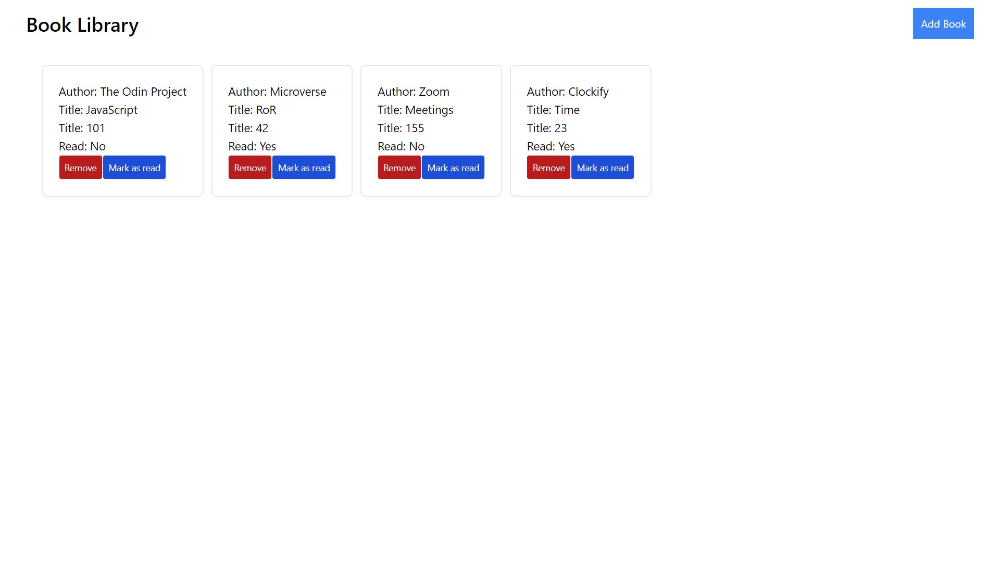

# Simple Library

This is a Simple library  build with vanilla javascipt.

## Screenshots



## Built With 🔨
- Javascript


## Live Demo 🚀
[Library](https://omar-labana.github.io/library/)

### Prerequisites
- Node.js & npm installed.
- Git and any terminal to run commands.

### Installation

1. Clone the repo
   ```sh
   git clone https://github.com/omar-labana/portfolio.git
   ```
2. Install NPM packages
   ```sh
   npm install
   ```


